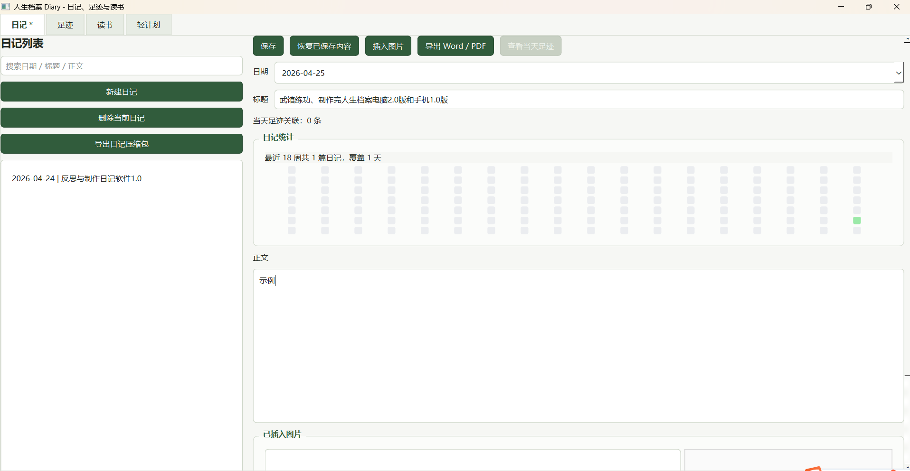
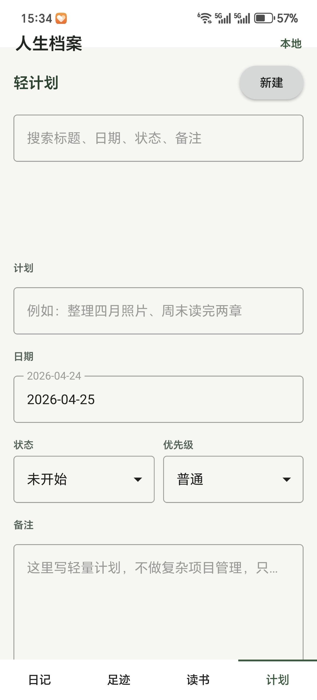

# 人生档案 Diary - 日记、足迹、读书笔记与轻计划

当前这一版已经从“纯日记”扩到“日记 + 足迹 + 读书笔记 + 轻计划”，并同步完成了桌面版与 Android 手机版的基础交付。核心目标仍然是本地优先、长期可保存、结构清晰、后续方便继续扩。

已完成的主要能力：

- 日记模块完整 CRUD
- 足迹模块完整 CRUD
- 读书笔记模块完整 CRUD
- 日记支持按日期搜索和查看历史记录
- 足迹支持按地点 / 简介 / 日期 / 感悟搜索
- 读书笔记支持按书名 / 作者 / 标签 / 笔记 / 关联日记搜索
- 日记 / 足迹 / 读书笔记都支持插入图片、预览图片、删除图片、给图片写备注名
- 足迹和当日日记支持双向跳转
- 读书笔记支持关联若干篇日记，并从书籍页直接打开关联日记
- 足迹采用“两层结构”：地点档案 + 多个日期关联记录
- 轻计划支持本地 CRUD、搜索和标记完成
- 日记支持按时间范围导出多天内容为 Word 和 PDF
- PDF 由 Word 文档直接转换生成，保持一致版式
- 日记 / 足迹 / 读书三模块都支持导出为压缩包交换包
- 日记页包含最近 18 周绿色热力统计图
- 电脑版已打包为可双击运行的直装安装器，支持选择安装路径，安装完成后可直接启动
- Android 手机版已完成 APK 构建、签名和真机安装验证，应用名为“人生档案”，并接入自定义软件图标

## 2.0 版本完成内容

2.0 版本主要围绕“多模块长期记录”和“桌面端可用性”继续扩展：

- 新增轻计划模块，支持计划的新建、编辑、保存、搜索、删除和标记完成。
- 日记、足迹、读书三个核心模块分别支持导出 `.zip` 压缩包交换包。
- 压缩包内保留原始模块目录结构，并附带 `manifest.json`，方便后续做多端互通。
- 日记页新增最近 18 周绿色热力统计图，可以直观看到写日记的频率。
- 软件界面完成统一美化，按钮、输入框、列表、页签和分组区域采用统一浅色绿色系样式。
- 四个页面改为整页滚动布局，每个功能区域可以设计得更大，不再强行挤在一屏里。
- 完成电脑版直装安装器，安装包位于 `电脑直装版/最终安装包/人生档案安装器.exe`。
- 电脑版安装器支持自选安装路径，安装完成后提供“启动人生档案”按钮，不再依赖 `.bat` 启动，避免残留黑色命令行窗口。
- 电脑版安装后的数据默认保存在安装目录下的 `data/Diary/`，便于整体移动和备份。
- 同步完成 Qt 6/QML Android 手机版，已生成可安装的签名 APK，并在真机正常安装运行。
- 手机版接入“人生档案”应用名和自定义启动图标。
- README、Todo 和测试覆盖同步更新，补充轻计划、交换包和主窗口四页签验证。

## 界面预览

### 电脑版

| 日记 | 足迹 |
| --- | --- |
|  |  |

| 读书笔记 | 轻计划 |
| --- | --- |
|  |  |

### Android 手机版

| 日记 | 足迹 |
| --- | --- |
|  |  |

| 读书笔记 | 轻计划 |
| --- | --- |
|  |  |

## 运行

### 电脑直装版

最终安装包位于：

```text
电脑直装版/最终安装包/人生档案安装器.exe
```

双击 `人生档案安装器.exe` 后，可以选择安装路径。安装完成后点击安装器里的“启动人生档案”按钮即可运行。

直装版启动程序为 `人生档案.exe`，采用无控制台窗口方式启动，不需要再通过 `.bat` 运行，因此不会残留黑色命令行窗口。

### 源码运行

```powershell
python main.py
```

## Android 手机版

手机端工程位于 `diary_android/`，基于 Qt 6/QML 实现，已同步桌面版的日记、足迹、读书笔记和轻计划四个模块。

当前已完成 Android `arm64-v8a` APK 构建、签名和真机安装验证。签名包文件名为 `LifeDiaryMobile-release-signed.apk`，适合放到 GitHub Release 作为安装包附件；源码仓库保留 Android 工程和构建配置，`build/` 构建产物不作为源码提交。

## 项目结构

```text
.
  src/life_dairy/              桌面版 PySide6 源码
  tests/                       桌面版自动化测试
  diary_android/               Qt 6/QML Android 手机版工程
  image/                       README 使用的界面截图
  电脑直装版/最终安装包/        电脑版安装器成品
  手机直装版/                  Android 签名 APK 成品
  data/                        本地运行数据，默认不提交
  pc_installer_work/           打包临时目录，默认不提交
  README.md                    项目说明
  LICENSE                      MIT 开源许可证
  requirements.txt             桌面版 Python 依赖
```

源码提交时重点保留 `src/`、`tests/`、`diary_android/`、`image/`、`README.md`、`LICENSE` 和依赖配置；运行数据、构建目录和打包中间物通过 `.gitignore` 排除。

## 数据目录

程序默认把数据保存到：

`data/Diary/`

如果使用电脑版直装安装器，数据会保存到安装目录下：

`<安装目录>/data/Diary/`

目录结构示例：

```text
data/
  Diary/
    entries/
      <entry_id>/
        entry.json
        content.md
        images/
          photo1.jpg
    footprints/
      <place_id>/
        footprint.json
        summary.md
        images/
          place1.jpg
        visits/
          <visit_id>/
            visit.json
            thought.md
            images/
              day1.jpg
    books/
      <book_id>/
        book.json
        summary.md
        notes.md
        images/
          cover.jpg
    plans/
      <plan_id>/
        plan.json
```

其中：

- `entries/` 保存日记
- `footprints/` 保存地点足迹
- `books/` 保存读书笔记
- `plans/` 保存轻计划
- `footprint.json` 保存地点档案元数据
- `summary.md` 保存地点或书籍的摘要说明
- `visits/<visit_id>/visit.json` 保存某次足迹日期关联的元数据
- `visits/<visit_id>/thought.md` 保存这一天的感悟
- `book.json` 保存书籍元数据与关联日记信息
- `notes.md` 保存读书笔记正文
- `images/` 保存当前记录关联的图片
- 每条记录独立存放，便于手工备份和后续做交换包

## 当前范围

已完成：

- 主窗口四页签：`日记` / `足迹` / `读书` / `轻计划`
- 日记列表、地点足迹列表、书单列表、轻计划列表
- 新建、查看、编辑、保存、删除
- 搜索日期 / 标题 / 正文 / 地点 / 简介 / 感悟 / 书名 / 作者 / 标签 / 笔记 / 计划
- 插入图片
- 图片备注名
- 打开已插入图片
- 移除已插入图片
- 本地读取
- 恢复已保存内容
- 未保存内容切换提示
- 日记导出 Word / PDF
- 日记按时间范围导出多篇
- 足迹和当日日记双向跳转
- 地点档案下可新增多个日期关联
- 每个日期关联可单独写感悟和上传图片
- 读书笔记可关联若干篇日记并直接打开
- 轻计划可新建、保存、搜索、删除和标记完成
- 日记 / 足迹 / 读书均可导出压缩包交换包
- 日记页显示最近 18 周热力统计图
- 页面整体支持滚动，内容区域可以保持更舒展的尺寸
- 电脑版直装安装器已完成，可选择安装路径并在安装结束后直接启动
- Android 手机版 APK 已完成签名和真机安装验证

暂未做：

- 自动保存
- 足迹地图 / 统计

## 这版交互

- 主窗口上方是四个页签：`日记`、`足迹`、`读书`、`轻计划`
- 日记页用于写日记、插图、导出、查看当天足迹
- 足迹页左侧是“地点足迹列表”，每一项代表一个地点档案
- 足迹页右侧上半部分用于编辑地点主题、地点粗略描述、地点图片
- 足迹页右侧下半部分用于给当前地点新增多个“日期关联记录”
- 每个日期关联都可以单独设置日期、当天感悟、当天图片，并打开对应日期的日记
- 读书页左侧是书单列表
- 读书页右侧上半部分用于编辑书名、作者、状态、标签、摘要和读书正文
- 读书页右侧下半部分用于管理书封/书籍图片，以及关联日记列表
- 轻计划页用于记录简单待办，可设置日期、状态、优先级和备注
- `保存` 用于提交当前页的文字和图片改动
- `恢复已保存内容` 用于放弃当前未保存修改，恢复到上次保存状态
- 图片列表下方可以给当前图片填写备注名；只有填写了备注名，导出日记时才会显示图片标题

## 读书笔记模块

- 可记录书名、作者、阅读状态
- 可填写开始日期和完成日期
- 标签用逗号分隔录入
- 可写“阅读摘要”和“读书笔记正文”
- 可添加书封或其它书籍图片
- 可关联若干篇已存在的日记
- 关联日记后可以直接从读书页打开对应日记

## 日记导出

- 导出入口在日记页
- 导出前会先保存当前日记
- 先选择开始和结束日期，再选择导出目录
- 导出的日记会按旧日期在前排序
- 同一个 Word / PDF 里可以包含很多天的日记
- 第二篇及后续日记会自动另起一页
- 选择一个导出目录后，会同时生成 `.docx` 和 `.pdf`
- `PDF` 直接由 `Word` 文档转换生成，字体、分页、图片顺序和 `Word` 保持一致
- 多篇导出时文件名默认采用 `开始日期_to_结束日期_篇数`
- 如果同名文件已存在，会自动追加编号，避免覆盖
- 导出内容只保留日记日期，不再写入创建时间和更新时间
- 图片只有在写了备注名时才显示标题；没写备注名时只导出图片本身

## 当前实现说明

- 日记、足迹、读书笔记都采用“每条记录一个独立目录”的本地存储方式
- 轻计划也采用独立目录保存，每条计划对应一个 `plan.json`
- 删除当前采用软删除：写入删除标记并从活动列表隐藏
- 足迹和日记的联动目前以“日期关联记录 -> 同日期日记”为主
- 足迹当前的真实结构是“地点为父级，日期记录为子级”
- 读书笔记和日记的联动目前以“选择现有日记后保存 entry_id + 日期 + 标题快照”为主
- 压缩包交换包会保留原始模块目录，并附带 `manifest.json` 描述模块、版本和导出时间

## 测试

项目目前包含：

- 日记存储测试
- 足迹存储测试
- 读书笔记存储测试
- 轻计划存储测试
- 日记导出测试
- 压缩包交换包导出测试
- 主窗口多页签与跨页跳转烟雾测试

验证命令：

```powershell
python -B -m unittest discover -s tests -v
```

## 开源许可

本项目使用 MIT License，详见 [LICENSE](LICENSE)。

## 版本迭代史

### 2.0

- 从三模块扩展为四模块：`日记`、`足迹`、`读书`、`轻计划`。
- 完成轻计划的基础设计与本地存储。
- 完成日记、足迹、读书三个模块的压缩包交换包导出。
- 增加日记绿色热力统计图。
- 完成桌面端整体美化和整页滚动布局优化。
- 完成电脑版直装安装器，支持自选安装路径和安装完成后直接启动。
- 完成 Android 手机版 APK 构建、签名、安装验证和应用图标配置。

### 1.5

- 从纯日记扩展到日记、足迹、读书笔记三模块。
- 足迹采用“地点档案 + 日期关联记录”的两层结构。
- 读书笔记支持关联已有日记，并可以跳转打开关联日记。
- 日记、足迹、读书笔记支持图片管理和图片备注。

### 1.0

- 完成最初的本地日记桌面版。
- 支持日记新建、编辑、保存、删除、搜索和历史查看。
- 支持按时间范围导出日记 Word / PDF。
