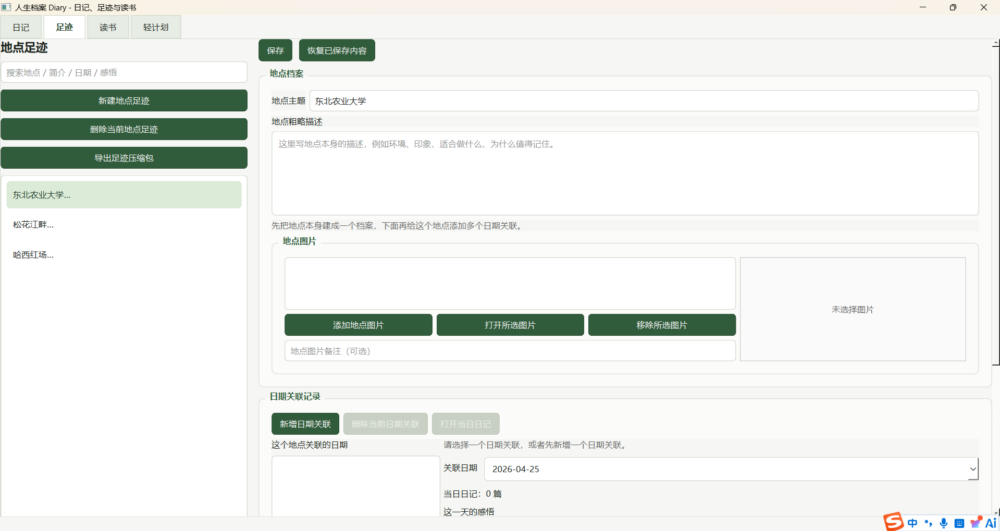
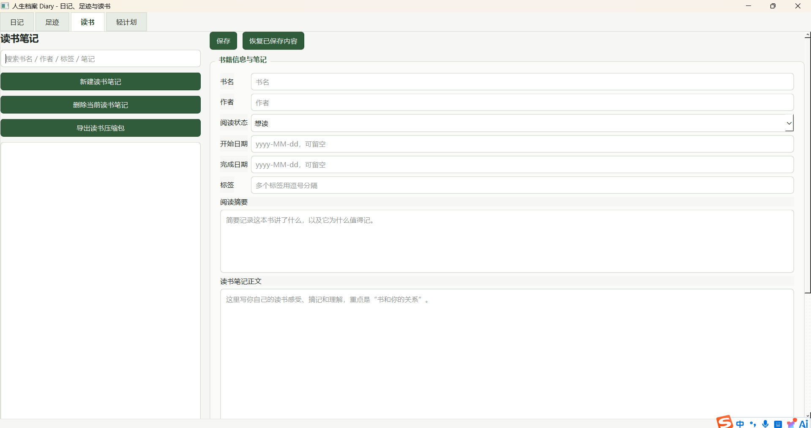
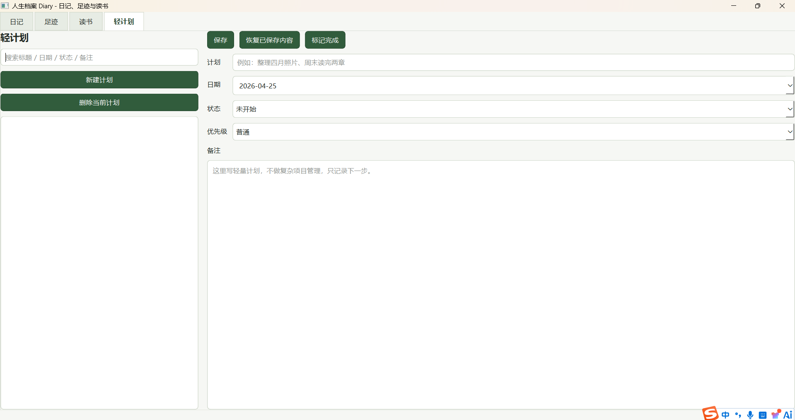
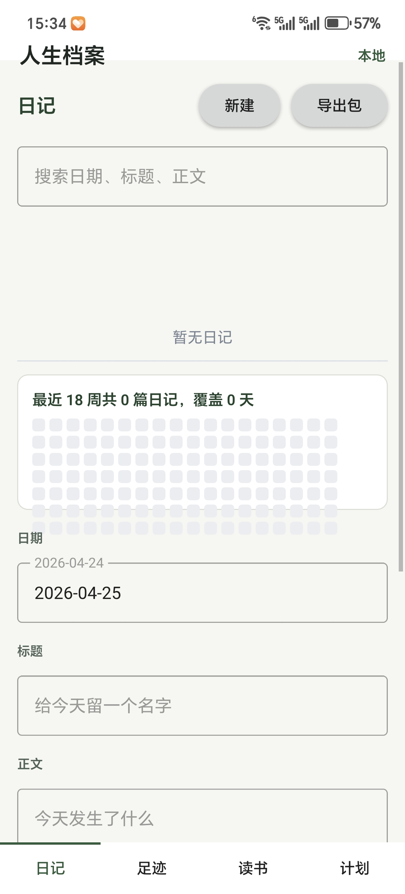
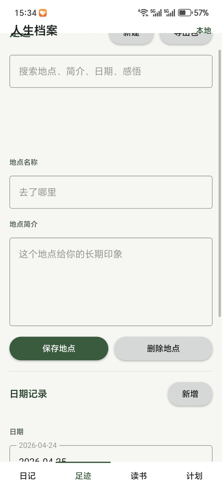
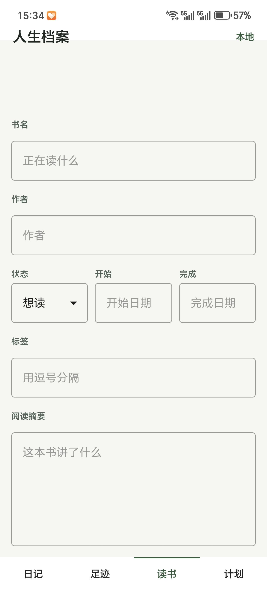

# 人生档案 Diary - 日记、足迹、读书笔记、轻计划与反思

当前这一版已经从“纯日记”扩到“总览 + 日记 + 足迹 + 读书笔记 + 轻计划 + 教训与反思 + 自我分析”。桌面端继续优先迭代新功能，Android 手机版慢一个版本同步。核心目标仍然是本地优先、长期可保存、结构清晰、后续方便继续扩。

已完成的主要能力：

- 日记模块完整 CRUD
- 总览页显示基础统计和最近记录时间线
- 足迹模块完整 CRUD
- 读书笔记模块完整 CRUD
- 教训与反思模块完整 CRUD
- 自我分析模块完整 CRUD
- 日记支持按日期搜索和查看历史记录
- 足迹支持按地点 / 简介 / 日期 / 感悟搜索
- 读书笔记支持按书名 / 作者 / 标签 / 笔记 / 关联日记搜索
- 教训与反思支持按标题 / 类型 / 标签 / 正文搜索，并可按事件类型筛选
- 自我分析支持按标题 / 分析类型 / 标签 / 正文搜索，并可按分析类型筛选
- 日记 / 足迹 / 读书笔记都支持插入图片、预览图片、删除图片、给图片写备注名
- 教训与反思支持添加截图 / 图片、打开图片、移除图片和图片备注名
- 自我分析支持添加图片 / 截图、打开图片、移除图片和图片备注名
- 足迹和当日日记支持双向跳转
- 读书笔记支持关联若干篇日记，并从书籍页直接打开关联日记
- 教训与反思支持关联若干篇日记，并从反思页直接打开关联日记
- 自我分析支持关联已有日记和教训与反思，并可从自我分析页打开关联日记或教训
- 足迹采用“两层结构”：地点档案 + 多个日期关联记录
- 轻计划支持本地 CRUD、搜索、筛选、标记完成，并支持“加法计划 / 减法计划”
- 总览页接入日记、足迹、读书、轻计划和教训与反思五类最近记录
- 日记、足迹、读书笔记、轻计划、教训与反思、自我分析六个可编辑页支持桌面端自动保存
- 总览页提供“备份数据”和“恢复备份”入口，支持把 `data/Diary/` 打包为 zip 并从合法备份包恢复
- 日记支持按时间范围导出多天内容为 Word 和 PDF
- PDF 由 Word 文档直接转换生成，保持一致版式
- 日记 / 足迹 / 读书三模块都支持导出为压缩包交换包
- 日记页包含最近 18 周绿色热力统计图
- 电脑版已打包为可双击运行的直装安装器，支持选择安装路径，安装完成后可直接启动
- Android 手机版已完成 APK 构建、签名和真机安装验证，应用名为“人生档案”，并接入自定义软件图标

## 2.0 版本完成内容

2.0 版本主要围绕“多模块长期记录”和“桌面端可用性”继续扩展：

- 新增轻计划模块，支持计划的新建、编辑、保存、搜索、删除和标记完成。
- 日记、足迹、读书三个核心模块分别支持导出 `.zip` 压缩包交换包。
- 压缩包内保留原始模块目录结构，并附带 `manifest.json`，方便后续做多端互通。
- 日记页新增最近 18 周绿色热力统计图，可以直观看到写日记的频率。
- 软件界面完成统一美化，按钮、输入框、列表、页签和分组区域采用统一浅色绿色系样式。
- 四个页面改为整页滚动布局，每个功能区域可以设计得更大，不再强行挤在一屏里。
- 完成电脑版直装安装器，安装包通过 GitHub Release 分发，不再作为源码文件提交。
- 电脑版安装器支持自选安装路径，安装完成后提供“启动人生档案”按钮，不再依赖 `.bat` 启动，避免残留黑色命令行窗口。
- 电脑版安装后的数据默认保存在安装目录下的 `data/Diary/`，便于整体移动和备份。
- 同步完成 Qt 6/QML Android 手机版，已生成可安装的签名 APK，并在真机正常安装运行。
- 手机版接入“人生档案”应用名和自定义启动图标。
- README、开发说明和测试覆盖同步更新，补充轻计划、交换包和主窗口四页签验证。

## 2.2 版本完成内容

2.2 版本继续采用“桌面端优先，Android 慢一个版本同步”的策略，重点补充两个轻量但长期有价值的记录能力：

- 新增桌面端“教训与反思”页签，用于记录重要事件、判断失误、项目踩坑、接单教训、学习反思和下次行动策略。
- 教训与反思数据保存到 `data/Diary/lessons/`，每条记录包含 `lesson.json`、`content.md` 和 `images/`。
- 教训与反思支持新建、编辑、保存、恢复、软删除、搜索、类型筛选、关联日记、打开关联日记、图片管理和图片备注。
- 在“轻计划”模块中新增“计划类型”，支持“加法计划”和“减法计划”。
- 减法计划支持记录“少做 / 不做 / 暂停 / 戒断”、触发场景、想避免的行为、原因和替代行为。
- 轻计划列表会区分显示 `【加法】` / `【减法】`，并支持按计划类型筛选。
- 旧的轻计划数据保持兼容；没有 `plan_type` 的旧 `plan.json` 会默认按加法计划读取。
- 本次没有修改 Android 目录，也没有构建 APK。

## 2.3 版本完成内容

2.3 版本新增桌面端“总览”页签，只做 MVP 级别的只读聚合，不改变原有数据目录结构：

- 新增“总览”页签，放在主窗口第一个位置。
- 顶部显示 8 个基础统计数字：本月日记篇数、本月日记总字数、本月日记图片数、本月完成计划数、今年日记篇数、今年日记总字数、今年日记图片数、今年完成计划数。
- 日记统计来自 `entries/` 中未删除日记；字数按正文文本长度粗略统计；图片数按日记 `images/` 目录文件数量统计。
- 完成计划数来自 `plans/` 中状态为“已完成”或“已做到”等完成态的计划。
- 下方显示最近 30 条记录时间线，按日期倒序排列。
- 时间线第一版接入日记、足迹、读书、轻计划、教训与反思五类记录。
- 提供“刷新总览”按钮，点击后重新读取本地数据。
- 本版本只更新桌面端功能，未修改 Android 目录，未构建 APK。

## 2.4 版本完成内容

2.4 版本新增桌面端自动保存能力，减少忘记点击“保存”导致内容丢失的问题：

- 日记、足迹、读书笔记、轻计划、教训与反思五个可编辑页接入自动保存。
- 用户停止编辑约 3 秒后触发保存；持续输入时会重置计时器，避免频繁写磁盘。
- 手动“保存”按钮仍然保留并继续可用。
- 页面切换和程序关闭前会先尝试保存未保存内容。
- “恢复已保存内容”会暂停自动保存计时器，避免恢复后立刻把未保存内容写回去。
- 新建空白草稿不会自动落盘，避免生成大量空白记录。
- 图片添加、移除和图片备注名修改也会纳入自动保存。
- 本版本只更新桌面端功能，未修改 Android 目录，未构建 APK。

## 2.5 版本完成内容

2.5 版本新增桌面端“数据备份与恢复”能力，用于防止误删、换电脑或文件损坏导致的数据丢失：

- 在总览页新增“备份数据”和“恢复备份”按钮。
- 备份会将当前 `data/Diary/` 整体打包为 `DiaryBackup_yyyy-MM-dd_HHmmss.zip`。
- 备份包内包含 `manifest.json` 和 `Diary/` 数据目录。
- `manifest.json` 记录备份类型、应用名、备份版本、应用版本、创建时间、数据根目录和模块列表。
- 恢复前会校验备份包，非法 zip、缺少 `manifest.json`、类型不正确或缺少 `Diary/` 的备份不会恢复。
- 恢复合法备份前，会先自动生成 `BeforeRestoreBackup_yyyy-MM-dd_HHmmss.zip` 保存当前数据。
- 恢复完成后会刷新桌面端各页面数据。
- 本版本只更新桌面端功能，未修改 Android 目录，未构建 APK。

## 2.6 版本完成内容

2.6 版本新增桌面端“自我分析”页签，用于记录情绪、梦、关系、欲望、重复模式、身体感受、接单焦虑、学习困境等个人观察与复盘内容：

- 新增桌面端“自我分析”页签，只作为个人书写、复盘和自我理解工具，不做心理诊断、疾病判断或 AI 自动分析。
- 自我分析数据保存到 `data/Diary/self_analysis/`，每条记录包含 `analysis.json`、`content.md` 和 `images/`。
- 支持新建、查看、编辑、保存、恢复已保存内容、软删除、搜索和按分析类型筛选。
- 支持设置日期、分析类型和标签；正文按触发事件、当时情绪、身体反应、表面想法、真正害怕、真正想要、重复模式、想象中的他人评价、防御方式、相似经历、看见了什么和下一步行动分段保存。
- 支持关联已有日记、打开关联日记、关联已有教训与反思，并可从自我分析页打开关联教训。
- 支持添加图片 / 截图、打开已添加图片、移除图片和填写图片备注名。
- 自我分析页接入桌面端自动保存；停止编辑约 3 秒后会尝试保存有内容的记录。
- 备份恢复识别 `self_analysis/` 模块；恢复完成后会刷新自我分析页面。
- 本版本只更新桌面端功能，未修改 Android 目录，未构建 APK。
## 界面预览

### 电脑版

| 总览 | 日记 |
| --- | --- |
| 暂无截图 |  |

| 足迹 | 读书笔记 |
| --- | --- |
|  |  |

| 轻计划 | 教训与反思 |
| --- | --- |
|  | 暂无截图 |

### Android 手机版

| 日记 | 足迹 |
| --- | --- |
|  |  |

| 读书笔记 | 轻计划 |
| --- | --- |
|  |  |

## 运行

### 电脑直装版

Windows 安装器通过 GitHub Release 分发。下载 `人生档案安装器.exe` 后双击运行，可以选择安装路径。

安装完成后点击安装器里的“启动人生档案”按钮即可运行。

直装版启动程序为 `人生档案.exe`，采用无控制台窗口方式启动，不需要再通过 `.bat` 运行，因此不会残留黑色命令行窗口。

### 源码运行

```powershell
python main.py
```

也可以双击或运行：

```powershell
.\scripts\run_diary.bat
```

## Android 手机版

手机端工程位于 `android/LifeDiaryMobile/`，基于 Qt 6/QML 实现，已同步桌面版的日记、足迹、读书笔记和轻计划四个模块。

当前已完成 Android `arm64-v8a` APK 构建、签名和真机安装验证。签名包文件名为 `LifeDiaryMobile-release-signed.apk`，适合放到 GitHub Release 作为安装包附件；源码仓库只保留 Android 工程和构建配置，`build/` 构建产物不作为源码提交。

## 项目结构

```text
.
  src/life_dairy/              桌面版 PySide6 源码
  tests/                       桌面版自动化测试
  android/                     Qt 6/QML Android 手机版工程
    LifeDiaryMobile/
  docs/
    screenshots/               README 使用的界面截图
    dev-notes/                 开发过程说明
    release-notes/             版本发布说明
  assets/
    icons/                     桌面端与移动端图标资源
  scripts/                     本地运行和构建辅助脚本
  packaging/windows/           Windows 安装器源码和配置
  data/                        本地运行数据，默认不提交
  release/                     本地发布输出目录，默认不提交
  README.md                    项目说明
  LICENSE                      MIT 开源许可证
  pyproject.toml               Python 项目元数据
  requirements.txt             桌面版 Python 依赖
```

源码提交时重点保留 `src/`、`tests/`、`android/`、`docs/`、`assets/`、`scripts/`、`packaging/`、`README.md`、`LICENSE` 和依赖配置；运行数据、构建目录、安装包、APK 和打包中间物通过 `.gitignore` 排除，并通过 GitHub Release 分发。

## 数据目录

程序默认把数据保存到：

`data/Diary/`

如果使用电脑版直装安装器，数据会保存到安装目录下：

`<安装目录>/data/Diary/`

目录结构示例：

```text
data/
  Diary/
    entries/
      <entry_id>/
        entry.json
        content.md
        images/
          photo1.jpg
    footprints/
      <place_id>/
        footprint.json
        summary.md
        images/
          place1.jpg
        visits/
          <visit_id>/
            visit.json
            thought.md
            images/
              day1.jpg
    books/
      <book_id>/
        book.json
        summary.md
        notes.md
        images/
          cover.jpg
    plans/
      <plan_id>/
        plan.json
    lessons/
      <lesson_id>/
        lesson.json
        content.md
        images/
```

其中：

- `entries/` 保存日记
- `footprints/` 保存地点足迹
- `books/` 保存读书笔记
- `plans/` 保存轻计划，`plan.json` 中包含加法 / 减法计划字段
- `lessons/` 保存教训与反思
- `footprint.json` 保存地点档案元数据
- `summary.md` 保存地点或书籍的摘要说明
- `visits/<visit_id>/visit.json` 保存某次足迹日期关联的元数据
- `visits/<visit_id>/thought.md` 保存这一天的感悟
- `book.json` 保存书籍元数据与关联日记信息
- `notes.md` 保存读书笔记正文
- `lesson.json` 保存反思元数据、事件类型、严重程度、标签、关联日记和图片备注
- `lessons/<lesson_id>/content.md` 保存反思正文，按事件经过、当时判断、结果、判断错误、真正问题、代价、下次策略和一句话教训分段
- `images/` 保存当前记录关联的图片
- 每条记录独立存放，便于手工备份和后续做交换包

## 当前范围

已完成：

- 主窗口七页签：`总览` / `日记` / `足迹` / `读书` / `轻计划` / `教训与反思` / `自我分析`
- 总览统计区、最近记录时间线、日记列表、地点足迹列表、书单列表、轻计划列表、反思记录列表
- 新建、查看、编辑、保存、删除
- 搜索日期 / 标题 / 正文 / 地点 / 简介 / 感悟 / 书名 / 作者 / 标签 / 笔记 / 计划 / 反思内容
- 插入图片
- 图片备注名
- 打开已插入图片
- 移除已插入图片
- 本地读取
- 恢复已保存内容
- 未保存内容切换提示
- 日记导出 Word / PDF
- 日记按时间范围导出多篇
- 足迹和当日日记双向跳转
- 地点档案下可新增多个日期关联
- 每个日期关联可单独写感悟和上传图片
- 读书笔记可关联若干篇日记并直接打开
- 轻计划可新建、保存、搜索、筛选、删除和标记完成
- 轻计划支持“加法计划”和“减法计划”，减法计划可记录触发场景、避免行为、原因和替代行为
- 教训与反思可新建、保存、搜索、按类型筛选、软删除、关联日记和管理图片
- 自我分析可新建、保存、搜索、按分析类型筛选、软删除、关联日记、关联教训和管理图片
- 总览页可刷新并展示 8 个基础统计数字和最近 30 条跨模块时间线
- 总览页可手动备份数据，也可从合法 zip 备份包恢复数据
- 六个可编辑页支持自动保存，状态栏会提示已保存、有未保存修改、自动保存中、已自动保存或自动保存失败
- 日记 / 足迹 / 读书均可导出压缩包交换包
- 日记页显示最近 18 周热力统计图
- 页面整体支持滚动，内容区域可以保持更舒展的尺寸
- 电脑版直装安装器已完成，可选择安装路径并在安装结束后直接启动
- Android 手机版 APK 已完成签名和真机安装验证

暂未做：

- 足迹地图 / 统计

## 这版交互

- 主窗口上方是七个页签：`总览`、`日记`、`足迹`、`读书`、`轻计划`、`教训与反思`、`自我分析`
- 总览页顶部是本月 / 今年的日记和计划统计，下方是最近 30 条记录时间线
- 总览页右上角提供“备份数据”和“恢复备份”按钮
- 日记页用于写日记、插图、导出、查看当天足迹
- 足迹页左侧是“地点足迹列表”，每一项代表一个地点档案
- 足迹页右侧上半部分用于编辑地点主题、地点粗略描述、地点图片
- 足迹页右侧下半部分用于给当前地点新增多个“日期关联记录”
- 每个日期关联都可以单独设置日期、当天感悟、当天图片，并打开对应日期的日记
- 读书页左侧是书单列表
- 读书页右侧上半部分用于编辑书名、作者、状态、标签、摘要和读书正文
- 读书页右侧下半部分用于管理书封/书籍图片，以及关联日记列表
- 轻计划页用于记录简单待办，可设置计划类型、日期、状态、优先级、标签和备注
- 加法计划用于记录“我要做什么”；减法计划用于记录“我要少做 / 不做什么”，并可填写减法类型、触发场景、想避免的行为、原因和替代行为
- 教训与反思页用于记录事件经过、当时判断、结果、判断错误、真正问题、代价、下次策略和一句话教训
- 自我分析页用于记录情绪、梦、关系、欲望、重复模式、身体感受、接单焦虑和学习困境等个人观察，不提供心理诊断或 AI 自动分析
- `保存` 用于提交当前页的文字和图片改动
- 自动保存会在停止编辑约 3 秒后尝试提交当前页改动
- `恢复已保存内容` 用于放弃当前未保存修改，恢复到上次保存状态
- 图片列表下方可以给当前图片填写备注名；只有填写了备注名，导出日记时才会显示图片标题

## 读书笔记模块

- 可记录书名、作者、阅读状态
- 可填写开始日期和完成日期
- 标签用逗号分隔录入
- 可写“阅读摘要”和“读书笔记正文”
- 可添加书封或其它书籍图片
- 可关联若干篇已存在的日记
- 关联日记后可以直接从读书页打开对应日记

## 轻计划模块

- 计划类型分为“加法计划”和“减法计划”。
- 加法计划沿用原来的轻计划用法，适合记录“我要做什么”。
- 减法计划适合记录“我要少做 / 不做什么”，支持设置“少做 / 不做 / 暂停 / 戒断”。
- 减法计划可额外填写触发场景、我想避免的行为、为什么要避免和替代行为。
- 左侧列表会用 `【加法】` / `【减法】` 区分计划类型。
- 左侧支持按“全部 / 加法计划 / 减法计划”筛选。
- 旧版 `plan.json` 没有 `plan_type` 字段时，会默认作为加法计划读取。

## 教训与反思模块

- 可记录学习、接单、情绪、人际、金钱、项目、身体、其他等事件类型。
- 可设置轻微、中等、重要、严重四种严重程度。
- 正文按事件经过、当时判断、结果、判断错误、真正问题、代价、下次策略和一句话教训组织。
- 支持按标题、事件类型、标签、正文和图片备注搜索。
- 支持关联已有日记，并从反思页直接打开关联日记。
- 支持添加图片 / 截图、打开图片、移除图片和填写图片备注名。

## 自我分析模块
- 可记录情绪、梦、关系、欲望、重复模式、身体感受、接单焦虑、学习困境和其他类型。
- 只作为个人书写、复盘和自我理解工具，不做心理诊断、疾病判断或 AI 自动分析。
- 正文按触发事件、当时情绪、身体反应、表面想法、真正害怕、真正想要、重复模式、想象中的他人评价、防御方式、相似经历、看见了什么和下一步行动组织。
- 支持按标题、分析类型、标签、正文、关联记录和图片备注搜索。
- 支持关联已有日记并从自我分析页打开，也支持保存和打开关联教训与反思。
- 支持添加图片 / 截图、打开图片、移除图片和填写图片备注名。
## 总览页 MVP

- 总览页只做本地只读聚合，不写入新的业务数据。
- 顶部 8 个统计数字按本月和今年两个范围展示日记篇数、日记字数、日记图片数和完成计划数。
- 日记字数按 `content.md` 文本长度粗略统计。
- 日记图片数按每条日记 `images/` 目录中的文件数量统计。
- 完成计划数按计划状态判断，`已完成` 和 `已做到` 都会算入完成。
- 最近记录时间线最多显示 30 条，按日期倒序排列。
- 时间线已接入日记、足迹、读书、轻计划和教训与反思。
- “刷新总览”按钮会重新读取本地数据并刷新界面。

## 数据备份与恢复

- “备份数据”会提示选择保存目录，并生成一个 zip 备份包。
- 备份包文件名形如 `DiaryBackup_2026-05-01_153000.zip`。
- 备份包根目录包含 `manifest.json`，数据放在 `Diary/` 目录下。
- “恢复备份”会提示选择 `.zip` 文件，并先校验备份包是否合法。
- 恢复前会自动备份当前数据，文件名形如 `BeforeRestoreBackup_2026-05-01_153000.zip`。
- 非法备份包不会覆盖当前数据。
- 恢复完成后会刷新总览、日记、足迹、读书、轻计划和教训与反思页面。

## 日记导出

- 导出入口在日记页
- 导出前会先保存当前日记
- 先选择开始和结束日期，再选择导出目录
- 导出的日记会按旧日期在前排序
- 同一个 Word / PDF 里可以包含很多天的日记
- 第二篇及后续日记会自动另起一页
- 选择一个导出目录后，会同时生成 `.docx` 和 `.pdf`
- `PDF` 直接由 `Word` 文档转换生成，字体、分页、图片顺序和 `Word` 保持一致
- 多篇导出时文件名默认采用 `开始日期_to_结束日期_篇数`
- 如果同名文件已存在，会自动追加编号，避免覆盖
- 导出内容只保留日记日期，不再写入创建时间和更新时间
- 图片只有在写了备注名时才显示标题；没写备注名时只导出图片本身

## 当前实现说明

- 日记、足迹、读书笔记都采用“每条记录一个独立目录”的本地存储方式
- 轻计划也采用独立目录保存，每条计划对应一个 `plan.json`；减法计划只是在原有 `plans/` 结构中增加字段，不新增重度计划系统
- 教训与反思采用独立目录保存，每条反思对应一个 `lesson.json`、一个 `content.md` 和一个 `images/` 目录
- 自我分析采用独立目录保存，每条分析对应一个 `analysis.json`、一个 `content.md` 和一个 `images/` 目录
- 总览页不新增业务数据目录，只在运行时聚合现有模块数据
- 自动保存沿用各模块原有保存逻辑，不改变数据目录结构
- 备份恢复沿用 `data/Diary/` 原有目录结构，zip 中使用 `Diary/` 作为数据根目录
- 删除当前采用软删除：写入删除标记并从活动列表隐藏
- 足迹和日记的联动目前以“日期关联记录 -> 同日期日记”为主
- 足迹当前的真实结构是“地点为父级，日期记录为子级”
- 读书笔记和日记的联动目前以“选择现有日记后保存 entry_id + 日期 + 标题快照”为主
- 教训与反思和日记的联动同样保存 entry_id + 日期 + 标题快照
- 自我分析和日记的联动保存 entry_id + 日期 + 标题快照；和教训与反思的联动保存 lesson_id + 日期 + 标题快照
- 压缩包交换包会保留原始模块目录，并附带 `manifest.json` 描述模块、版本和导出时间

## 测试

项目目前包含：

- 日记存储测试
- 足迹存储测试
- 读书笔记存储测试
- 轻计划存储测试，覆盖加法计划、减法计划、旧数据兼容、搜索、筛选、完成和删除
- 教训与反思存储测试
- 自我分析存储测试
- 总览页聚合测试，覆盖基础统计和五类时间线记录
- 自动保存测试，覆盖日记、轻计划、教训与反思、自我分析、页签切换、图片备注、恢复已保存内容和空白草稿
- 备份恢复测试，覆盖备份包结构、manifest、合法/非法校验、安全备份和恢复后可读取
- 日记导出测试
- 压缩包交换包导出测试
- 主窗口多页签与跨页跳转烟雾测试

验证命令：

```powershell
python -B -m unittest discover -s tests -v
```

## 开源许可

本项目使用 MIT License，详见 [LICENSE](LICENSE)。

## 开发感悟

花了两天，终于把一个完整的小项目做完了。

从昨天晚上开工到现在，电脑版经历了两次大规模迭代，手机版也做出了第一版 APK。中间踩了不少坑：Qt Android 的 SDK 版本不对，第一版手机端一打开就闪退；后来费了好大劲连上 adb，排掉后台抢进程的问题，终于抓到错误提示，又重新下载 SDK、改 kits、刷新配置，才成功编译。相比之下，电脑端 EXE 倒是顺利很多，用 Python 打包工具一次就跑通了。

一口气废寝忘食忙到现在，回头看，自己确实有点太兴奋了。真正完成以后，第一反应反而是疲惫和落寞。

最近情绪慢慢恢复了一些，不过依然悲多喜少。也许我是把这个软件当成了一个短暂逃离纷乱现实的方法，所以才能这么投入地一直做下去。

天马上要黑了。星光依旧。

来路已经很远，后面的路也还很长。有些人慢慢远了，有些话依然没有说完。不过至少，它们可以在这个软件里被好好保存，而不是散落在某个夜晚的草地上，在柔和的星光下被晓风吹散。

蛮开心的，也有点累。嗯。

## 版本迭代史

### 2.6 (Current)

- 桌面端新增“自我分析”页签，支持记录情绪、梦、关系、欲望、重复模式、身体感受、接单焦虑、学习困境和其他自我观察。
- 新增 `data/Diary/self_analysis/` 数据目录，每条记录保存为 `analysis.json + content.md + images/`。
- 支持自我分析记录的新建、编辑、保存、恢复、软删除、搜索、类型筛选、图片管理、关联日记和关联教训。
- 自我分析页接入自动保存；备份恢复识别 `self_analysis/` 模块。
- 本模块不做心理诊断、疾病判断或 AI 自动分析。
- 本版本只更新桌面端功能，Android 手机版暂不变。
### 2.5

- 桌面端新增“数据备份与恢复”功能，入口位于总览页。
- 支持把当前 `data/Diary/` 打包为包含 `manifest.json` 的 zip 备份包。
- 支持校验并恢复合法备份包，恢复前自动生成 `BeforeRestoreBackup_...zip`。
- 非法备份包不会覆盖当前数据。
- 恢复成功后会刷新桌面端各页面。
- 本版本只更新桌面端功能，Android 手机版暂不变。

### 2.4

- 桌面端新增自动保存能力，覆盖日记、足迹、读书笔记、轻计划和教训与反思。
- 自动保存使用延迟计时器，停止编辑约 3 秒后写入本地数据。
- 页面切换和关闭前会尝试保存未保存内容。
- 恢复已保存内容时会暂停自动保存，避免恢复后立即覆盖。
- 空白新草稿不会自动落盘，图片备注修改也会被保存。
- 本版本只更新桌面端功能，Android 手机版暂不变。

### 2.3

- 桌面端新增“总览”页签，展示本月 / 今年日记与计划基础统计。
- 总览页新增最近 30 条跨模块时间线，接入日记、足迹、读书、轻计划和教训与反思。
- 新增“刷新总览”按钮，可重新读取本地数据。
- 总览页只读聚合现有 `data/Diary/` 数据，不改变原有目录结构。
- 本版本只更新桌面端功能，Android 手机版暂不变。

### 2.2

- 桌面端新增“教训与反思”页签，支持反思记录的新建、编辑、保存、删除、搜索、筛选、图片管理和关联日记。
- 新增 `data/Diary/lessons/` 数据目录，每条反思保存为 `lesson.json + content.md + images/`。
- 轻计划新增“计划类型”，支持加法计划和减法计划。
- 减法计划支持记录减法类型、触发场景、想避免的行为、原因和替代行为。
- 轻计划支持按全部 / 加法计划 / 减法计划筛选，旧计划默认按加法计划兼容读取。
- 本版本只更新桌面端功能，Android 手机版暂不变。

### 2.1

- 修复手机版各个界面区域的滚动的的问题，提升长文编辑体验。
- 优化手机版日记页面布局，解决中间区域（如图片列表、关联足迹等）在内容较多时显示不全及元素重叠的问题。
- 修复了电脑版导出Word/PDF文件，无法选择时间的Bug。

### 2.0

- 从三模块扩展为四模块：`日记`、`足迹`、`读书`、`轻计划`。
- 完成轻计划的基础设计与本地存储。
- 完成日记、足迹、读书三个模块的压缩包交换包导出。
- 增加日记绿色热力统计图。
- 完成桌面端整体美化和整页滚动布局优化。
- 完成电脑版直装安装器，支持自选安装路径和安装完成后直接启动。
- 完成 Android 手机版 APK 构建、签名、安装验证和应用图标配置。

### 1.5

- 从纯日记扩展到日记、足迹、读书笔记三模块。
- 足迹采用“地点档案 + 日期关联记录”的两层结构。
- 读书笔记支持关联已有日记，并可以跳转打开关联日记。
- 日记、足迹、读书笔记支持图片管理和图片备注。

### 1.0

- 完成最初的本地日记桌面版。
- 支持日记新建、编辑、保存、删除、搜索和历史查看。
- 支持按时间范围导出日记 Word / PDF。
