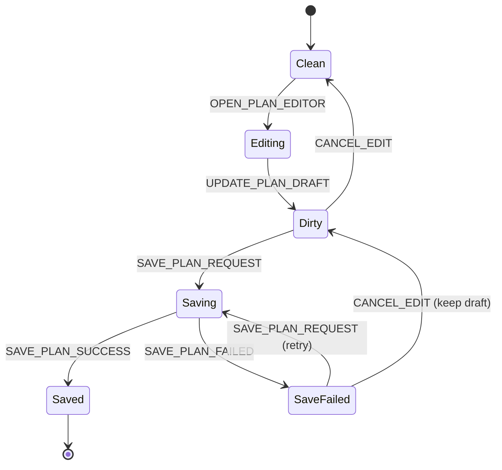
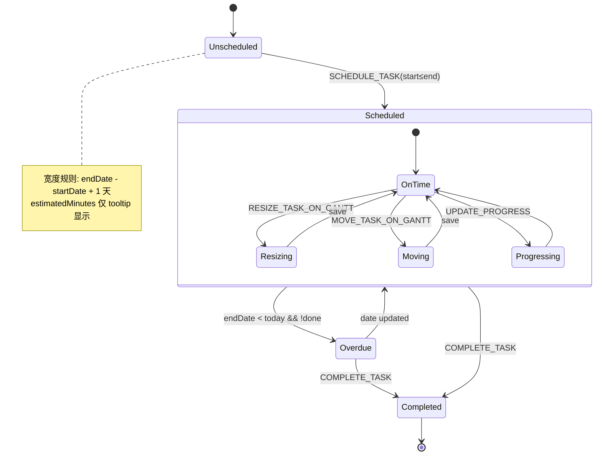
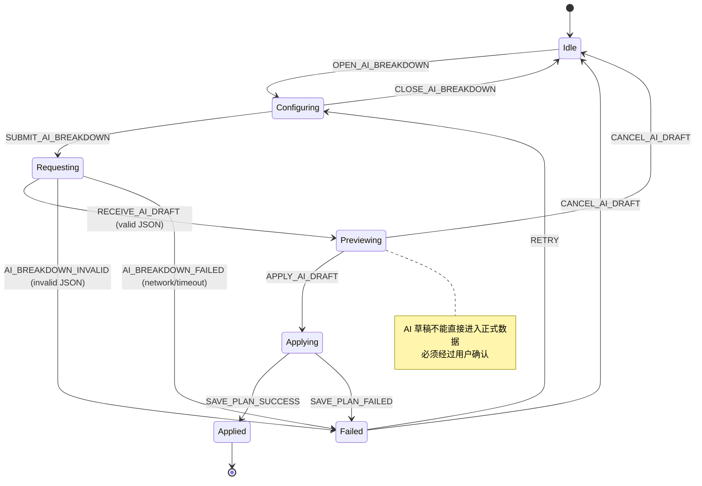

# ActionPlan V2 Lifecycle Model

> 本文档用生命周期方式描述 ActionPlan 页面、计划、任务、甘特图任务、任务链节点、AI 草稿的状态流转。
>
> 与其它规格文件的关系：
> - `spec.md` 定义需求验收条件
> - `state-model.md` 定义 state/event 结构
> - **`lifecycle.md` 定义行为约束和状态机**
>
> 三者冲突时，以 change 下的 `lifecycle.md` 和 `state-model.md` 为准。

---

## 1. Page Lifecycle

页面从启动到就绪的生命周期。

```
                    ┌────────┐
                    │NotMounted│
                    └────┬───┘
                    INIT_PAGE
                        │
                    ┌───▼───┐
              ┌─────│Loading│─────┐
              │     └───────┘     │
          LOAD_SUCCESS       LOAD_FAILED
              │                  │
          ┌───▼──┐          ┌────▼────┐
          │Ready │     ┌────│  Error  │
          └──┬───┘     │    └─────────┘
             │         │         │
         REFRESH    RETRY   CHANGE_QUERY
             │         │         │
             └───────Loading─────┘
```

| Current State | Event | Condition | Next State | View Update |
|---|---|---|---|---|
| NotMounted | INIT_PAGE | 无 | Loading | 全页 loading spinner |
| Loading | LOAD_SUCCESS(plans) | plans.length>0 | Ready | 列表填充，右侧显示第一个计划 |
| Loading | LOAD_SUCCESS([]) | 空 | Ready | 空状态引导 |
| Loading | LOAD_FAILED(msg) | 无 | Error | 错误提示 + 重试按钮 |
| Error | RETRY | 无 | Loading | 重新请求 |
| Error | CHANGE_QUERY | 无 | Ready(query updated) | 列表本地过滤 |
| Ready | REFRESH | 无 | Loading | 保留当前数据，显示刷新指示 |
| Ready | CHANGE_QUERY | 无 | Ready | 列表本地过滤 |
| 任意 | SWITCH_VIEW | 无 | 不变 | 右侧视图切换（不触发 API） |

**规则：**
- Page 不在 Ready 状态时，所有计划/任务操作按钮禁用
- Error 状态保留上次成功加载的数据（不破坏现场）
- 视图切换不触发 API，纯本地状态切换

---

## 2. Plan Selection Lifecycle

选择计划、删除计划后的列表状态机。

```
              ┌──────────┐
              │ NoPlan   │
              └────┬─────┘
              SELECT_PLAN
                   │
              ┌────▼──────┐
        ┌─────│PlanSelected│
        │     └────┬───────┘
        │          │
   DELETE_PLAN   DELETE_PLAN
   _REQUEST      _REQUEST
        │          │
   ┌────▼───┐  ┌──▼───────┐
   │Deleting│  │ Deleting  │
   └────┬───┘  └──┬───────┘
        │         │
   DELETE_PLAN  DELETE_PLAN
   _SUCCESS     _FAILED
        │         │
   ┌────▼───┐  ┌──▼────────┐
   │PlanDel-│  │PlanSelected│ (保留原选中)
   │eted    │  │ error=msg │
   └────┬───┘  └───────────┘
        │
   回退到 plans[0]
   或 NoPlan
```

| Current State | Event | Condition | Next State | View Update |
|---|---|---|---|---|
| NoPlan | SELECT_PLAN(id) | id≠null | PlanSelected | 右侧显示计划内容 |
| PlanSelected | DELETE_PLAN_REQUEST(id) | id===selectedPlanId | Deleting | 显示确认弹窗 |
| Deleting | DELETE_PLAN_SUCCESS(id) | 剩余 plans>0 | PlanSelected(plans[0]) | 列表移除，右侧切换 |
| Deleting | DELETE_PLAN_SUCCESS(id) | 剩余 plans=0 | NoPlan | 列表清空，右侧空状态 |
| Deleting | DELETE_PLAN_FAILED(msg) | 无 | PlanSelected | 错误提示，保留原数据 |
| PlanSelected | SELECT_PLAN(null) | 无 | NoPlan（不出现，由删除触发） | — |

**规则：**
- Deleting 状态时保存按钮禁用
- 删除成功后如果还有其他计划，自动选中 plans[0]
- 删除失败保留原选中计划

---

## 3. Plan Editing Lifecycle

计划编辑弹窗的生命周期。关键规则：Dirty 数据不能静默丢失。

```
              ┌───────┐
              │ Clean │
              └───┬───┘
          OPEN_PLAN_EDITOR
              │
          ┌───▼───┐
          │Editing │
          └───┬───┘
              │
     ┌────────┼─────────┐
     │        │          │
UPDATE_   SAVE_PLAN   CANCEL_
PLAN_DRAFT _REQUEST    EDIT
     │        │          │
 ┌───▼──┐ ┌──▼────┐   ┌──▼──────┐
 │Dirty │ │Saving │   │Clean    │ (弹窗关闭，不保存)
 └───┬──┘ └──┬────┘   └─────────┘
     │       │
     │  ┌────┴────┐
     │  │         │
     │ SAVE_    SAVE_
     │ PLAN_    PLAN_
     │ SUCCESS  FAILED
     │  │         │
     │ ┌──▼───┐ ┌─▼───────┐
     │ │Saved │ │SaveFail- │
     │ └──┬───┘ │ed       │
     │    │     └──┬───────┘
     │    │        │
     │    │    重新编辑或关闭
     └────┘        │
               ┌───▼────┐
               │ Dirty  │ (保留编辑内容)
               └────────┘
```

| Current State | Event | Condition | Next State | View Update |
|---|---|---|---|---|
| Clean | OPEN_PLAN_EDITOR | 无 | Editing | 弹出编辑弹窗，预填当前计划数据 |
| Editing | UPDATE_PLAN_DRAFT(partial) | 无 | Dirty | 表单字段实时更新 |
| Dirty | SAVE_PLAN_REQUEST | 无 | Saving | 关闭弹窗，保存中 |
| Dirty | CANCEL_EDIT | 无 | Clean | 关闭弹窗，丢弃编辑内容 |
| Dirty | UPDATE_PLAN_DRAFT(partial) | 无 | Dirty | 继续编辑 |
| Saving | SAVE_PLAN_SUCCESS(plan) | 无 | Saved | 列表和头部刷新 |
| Saving | SAVE_PLAN_FAILED(msg) | 无 | SaveFailed | 错误提示 |
| SaveFailed | 重新编辑（SAVE_REQUEST） | 无 | Saving | 重新保存 |
| SaveFailed | CANCEL_EDIT | 无 | Dirty | 保留编辑内容，等待处理 |
| Saved | — | 无 | Clean | 编辑完成 |

**规则：**
- Dirty 状态关闭弹窗必须弹确认"放弃修改？"
- Saving 期间重复提交无效（按钮禁用）
- SaveFailed 后保留 draft，用户可以重试或关闭
- Saved 后 draft 同步到 plan（通过 SAVE_PLAN_SUCCESS 的返回值）
- 切换计划时如果 Dirty 必须阻止切换，先保存或放弃

---

## 4. Task Lifecycle

单个任务的状态机（与 done/progress 强相关）。

```
         ┌──────┐
         │ Todo │
         └──┬───┘
            │
    ┌───────┼──────────┐
    │       │           │
START_  TOGGLE_     BLOCK_
TASK    TASK_DONE   TASK
    │       │           │
 ┌──▼──┐ ┌──▼───┐  ┌──▼─────┐
 │Doing│ │Done  │  │Blocked │
 └──┬──┘ │progr-│  └──┬─────┘
    │    │ess=100│     │
    ├────┤done=tr│     ├────────┐
    │    │ue     │     │        │
    │    └───────┘  UNBLOCK_ DELETE_
    │                TASK    TASK
    │                 │        │
    └──────TOGGLE─────┘    ┌──▼────┐
           _DONE(false)    │Deleted│
               │           └───────┘
           ┌───▼──┐
           │ Todo │
           └──────┘
```

| Current State | Event | Condition | Next State | View Update |
|---|---|---|---|---|
| Todo | TOGGLE_TASK_DONE(true) | 无 | Done | 样式变灰，progress=100 |
| Doing | TOGGLE_TASK_DONE(true) | 无 | Done | 同上 |
| Todo | BLOCK_TASK | 无 | Blocked | 标记为阻塞 |
| Doing | BLOCK_TASK | 无 | Blocked | 同上 |
| Blocked | UNBLOCK_TASK | 无 | Todo | 解锁 |
| Blocked | TOGGLE_TASK_DONE(true) | blocked 不允许 | Blocked | 无变化 |
| Blocked | DELETE_TASK | 无 | Deleted | 从列表移除，清理 dependsOn |
| 任意 | DELETE_TASK | 无 | Deleted | 从列表移除，清理 dependsOn |

**规则：**
- `done=true` 时 `progress=100`（强制）
- Blocked 状态不能直接切换为 Done
- Deleted 状态不是标志位，是物理移除（同时清理 dependsOn 引用）
- `todo / doing / done / blocked` 对应 status 字段，`done` 是独立布尔字段

---

## 5. Gantt Task Lifecycle

甘特图任务条的生命周期。核心约束：日期范围驱动任务条宽度。

```
              ┌─────────────┐
              │ Unscheduled │  (scheduledDate 和 startDate 都为空)
              └──────┬──────┘
                 SCHEDULE_TASK
                     │
              ┌──────▼──────┐
              │  Scheduled  │  有 startDate=endDate
              └──────┬──────┘
                     │
             ┌───────┼────────┐
             │       │         │
      RESIZE_TASK  MOVE_TASK  UPDATE_
      (延长或缩短)  (整体偏移)  PROGRESS
             │       │         │
             └───┬───┘         │
                 │             │
           ┌─────▼──────┐  ┌──▼──────┐
           │InProgress  │  │Overdue  │ (derived)
           │(startDate< │  │(endDate< │
           │ endDate)   │  │ today && │
           └─────┬──────┘  │!done)    │
                 │         └─────────┘
            COMPLETE_TASK
                 │
           ┌─────▼────┐
           │Completed │  progress=100, done=true
           └──────────┘
```

| Current State | Event | Condition | Next State | View Update |
|---|---|---|---|---|
| Unscheduled | SCHEDULE_TASK(start, end) | start≤end | Scheduled | 甘特图出现任务条 |
| Scheduled | MOVE_TASK_ON_GANTT(newStart, newEnd) | newStart≤newEnd | Scheduled | 任务条整体移动 |
| Scheduled | RESIZE_TASK_ON_GANTT("left", d) | d≤endDate | Scheduled | 左边缘移动，宽度变化 |
| Scheduled | RESIZE_TASK_ON_GANTT("right", d) | d≥startDate | Scheduled | 右边缘移动，宽度变化 |
| Scheduled | MOVE_TASK_ON_GANTT(newStart, newEnd) | newStart>newEnd | Scheduled | 保持原状态，阻止操作 |
| Scheduled | COMPLETE_TASK | 无 | Completed | 任务条变灰，progress=100 |
| Scheduled | UPDATE_PROGRESS(p) | 0≤p≤100 | InProgress | 进度填充变化 |
| InProgress | UPDATE_PROGRESS(p) | 100 | Completed | 进度 100% |
| InProgress | MOVE_TASK_ON_GANTT | 无 | InProgress | 位置变化 |
| InProgress | RESIZE_TASK_ON_GANTT | 无 | InProgress | 跨度变化 |
| InProgress | endDate < today && !done | derived | Overdue | 逾期标记（派生，不存储） |
| Completed | — | 无 | Completed | 不再变化 |

**规则：**
- **任务条宽度由 `endDate - startDate + 1 天` 决定**
- `estimatedMinutes` **不参与条宽计算**，仅 tooltip 显示
- `startDate` 不能晚于 `endDate`，违反时操作被阻止
- `progress` 始终在 0-100 范围内
- Overdue 是 derived state（由 `endDate < today && !done` 计算），不直接存储
- 拖动任务条整体时两个日期同时偏移，跨度不变
- 边缘拖动只改变对应侧的日期

---

## 6. Chain Node Lifecycle

任务链节点的生命周期。核心约束：坐标和依赖分离。

```
           ┌───────────┐
           │AutoLayout │  无 chainX/chainY，按 startDate 自动排列
           └─────┬─────┘
                 │
            MOVE_NODE_ON_CHAIN
                 │
           ┌─────▼─────┐
           │ Positioned │  有 chainX/chainY
           └─────┬─────┘
                 │
     ┌───────────┼───────────┐
     │           │            │
MOVE_NODE_   UPDATE_TASK_  SELECT_
ON_CHAIN     DEPENDENCY    NODE
     │           │            │
     └────────┐  │     ┌──────▼─────┐
              │  │     │  Selected  │ 高亮边框
              │  │     └──────┬─────┘
              │  │            │
              │  │      DESELECT_NODE
              │  │            │
              │  │     ┌──────▼──────┐
              │  │     │ Positioned  │
              │  │     │or AutoLayout│
              │  │     └─────────────┘
              │  │
         ┌────▼──▼────┐
         │Dependency  │  dependsOn 已设置
         │Editing     │
         └─────┬──────┘
               │
         检测到循环 → 阻止
               │
         无循环 → 更新 dependsOn
```

| Current State | Event | Condition | Next State | View Update |
|---|---|---|---|---|
| AutoLayout | MOVE_NODE_ON_CHAIN(x, y) | 无 | Positioned | 节点移动到 (x,y)，保存坐标 |
| Positioned | MOVE_NODE_ON_CHAIN(x, y) | 无 | Positioned | 节点移动到新位置 |
| 任意 | SELECT_NODE(id) | 无 | Selected | 节点高亮边框 |
| Selected | DESELECT_NODE | 无 | 恢复到 Positioned/AutoLayout | 取消高亮 |
| 任意 | UPDATE_TASK_DEPENDENCY(deps) | 无循环 | DependencyEditing | 更新连线 |
| 任意 | UPDATE_TASK_DEPENDENCY(deps) | 有循环 | 保持当前状态 | 显示错误"循环依赖" |
| 任意 | DELETE_TASK | 无 | 移除 | 清理 dependsOn 引用 |

**规则：**
- MOVE_NODE_ON_CHAIN **只改变 `chainX / chainY`**，不改变 `startDate / endDate / dependsOn`
- UPDATE_TASK_DEPENDENCY **只改变 `dependsOn`**，不改变坐标
- 无 `chainX / chainY` 时进入 AutoLayout
- AutoLayout 规则：`startDate` 相同则同列，按索引纵向排列
- 无 `dependsOn` 时节点按 `startDate / scheduledDate` 自动连线
- 循环依赖检测：在 UPDATE_TASK_DEPENDENCY 事件处理时执行，检测到循环则阻止
- 删除任务时必须清理其他任务中对该任务 id 的 dependsOn 引用

---

## 7. AI Breakdown Lifecycle

AI 草稿生命周期。核心约束：**AI 草稿不能直接进入正式数据**。

```
              ┌──────┐
              │ Idle │
              └──┬───┘
          OPEN_AI_BREAKDOWN
              │
         ┌────▼───────┐
         │Configuring │  填充开始/截止日期、每日可用时间
         └────┬───────┘
              │
        SUBMIT_AI_BREAKDOWN
              │
         ┌────▼──────┐
         │Requesting │  调用 AI API
         └────┬──────┘
              │
     ┌────────┼─────────┐
     │        │          │
RECEIVE_  AI_BREAKDOWN  AI_BREAKDOWN
_AI_DRAFT _INVALID      _FAILED
     │        │          │
  ┌──▼────┐ ┌─▼──────┐ ┌▼──────┐
  │Previe-│ │Failed  │ │Failed │
  │wing   │ │(非法   │ │(网络/ │
  └──┬────┘ │JSON)   │ │超时)  │
     │      │显示原始  │ │       │
     │      │返回     │ └───────┘
     │      └────┬────┘
     │           │
     │      CANCEL_AI_DRAFT
     │           │
     │       ┌───▼───┐
     │       │  Idle │
     │       └───────┘
     │
  ┌──┴──────────┐
  │             │
APPLY_       CANCEL_
 AI_DRAFT     AI_DRAFT
  │             │
  │         ┌───▼───┐
  │         │  Idle │
  │         └───────┘
  │
┌─▼───────┐
│Applying │  写入计划数据 + 触发保存
└──┬──────┘
   │
  ┌┴─────────┐
  │  Applied │ + SAVE_PLAN_SUCCESS
  │  → 回到  │
  │  Ready   │
  └──────────┘
```

| Current State | Event | Condition | Next State | View Update |
|---|---|---|---|---|
| Idle | OPEN_AI_BREAKDOWN | selectedPlanId≠null | Configuring | 弹出日期设置弹窗 |
| Configuring | SUBMIT_AI_BREAKDOWN | 日期合法 | Requesting | 关闭弹窗，显示加载 |
| Configuring | CLOSE_AI_BREAKDOWN | 无 | Idle | 关闭弹窗 |
| Requesting | RECEIVE_AI_DRAFT(draft) | JSON 合法 | Previewing | 弹出 AI 预览弹窗 |
| Requesting | AI_RESPONSE_INVALID(raw) | 非法 JSON | Failed | 显示错误 + 原始返回 |
| Requesting | AI_BREAKDOWN_FAILED(msg) | 无 | Failed | 显示错误 |
| Previewing | APPLY_AI_DRAFT | 无 | Applying | 关闭弹窗，执行写入 |
| Previewing | CANCEL_AI_DRAFT | 无 | Idle | 关闭弹窗，不保存 |
| Previewing | RETRY | 无 | Configuring | 重新打开日期设置 |
| Failed | CANCEL_AI_DRAFT | 无 | Idle | 关闭 |
| Failed | RETRY | 无 | Configuring | 重新配置 |
| Applying | SAVE_PLAN_SUCCESS(plan) | 无 | Applied(Ready) | 列表刷新，today 视图 |
| Applying | SAVE_PLAN_FAILED(msg) | 无 | Failed | 显示保存错误 |

**规则：**
- AI 草稿从 Requesting 出来后**不能直接进入 Applying**，必须先经过 Previewing
- Previewing 状态显示只读预览内容，用户必须主动选择 APPLY 或 CANCEL
- CANCEL_AI_DRAFT **不改变任何正式数据**
- APPLY_AI_DRAFT 将 AI 草稿写入当前计划的 tasks/title/planType，然后触发 API 保存
- 非法 JSON 进入 Failed 状态，显示原始返回文本
- AI 返回旧格式 `date` 时在 RECEIVE_AI_DRAFT 事件处理中自动转换为 `scheduledDate=date, startDate=date, endDate=date`
- Previewing 状态不能重复发起 AI 请求

---

## 8. Cross-Lifecycle Rules

不同生命周期之间的约束：

| 规则 | 来源生命周期 | 约束目标 | 行为 |
|---|---|---|---|
| 页面未就绪时不能编辑 | Page: Not Ready | Plan/Task 编辑 | 所有操作按钮禁用 |
| 无计划时不能打开任务编辑器 | Plan Selection: NoPlan | Task Editing | 任务编辑按钮禁用 |
| 编辑 Dirty 时不能切换计划 | Plan Editing: Dirty | Plan Selection | 阻止切换，先保存或放弃 |
| AI Previewing 时不能再次发起 AI | AI: Previewing | AI Breakdown | AI 按钮禁用 |
| Saving 时不能删除计划 | Plan Editing: Saving | Plan Selection | 删除按钮禁用 |
| 删除任务必须更新 Gantt | Task: Deleted | Gantt Task | 甘特图同步移除 |
| 删除任务必须更新 Chain | Task: Deleted | Chain Node | 从 dependsOn 清理引用 |
| 任务 done=true 强制 Gantt completed | Task: Done | Gantt Task | progress=100, 条变灰 |
| 任务 done=false 不改变 Gantt scheduled | Task: Todo | Gantt Task | progress 不变 |
| Chain 拖拽不改变 Gantt | Chain: Dragging | Gantt Task | startDate/endDate 不变 |
| Gantt 拖拽不改变 Chain | Gantt: Moving | Chain Node | chainX/chainY 不变 |
| AUTO_SAVE 由状态机触发 | 任意:Saving | API | debounce 500ms 后触发 |

---

## 9. Mermaid Diagrams

### 9.1 Plan Editing Lifecycle



### 9.2 Gantt Task Lifecycle



### 9.3 AI Breakdown Lifecycle



---

## 10. Implementation Guidance

### 文件优先级

当规格文件之间出现冲突时，优先级如下：

```
最高：openspec/changes/action-plan-v2/lifecycle.md      (行为约束)
中：  openspec/changes/action-plan-v2/state-model.md    (state/event 结构)
中：  openspec/changes/action-plan-v2/specs/action-plan/spec.md  (需求验收)
低：  openspec/specs/action-plan/spec.md                (系统规格)
```

### 生命周期作为实现清单

每个生命周期中的状态都是 reducer 中的分支依据：

| 生命周期 | 对应 state 字段 | reducer 分支 |
|---|---|---|
| Page | loading, error | LOAD_SUCCESS / LOAD_FAILED |
| Plan Selection | selectedPlanId | SELECT_PLAN / DELETE_PLAN_* |
| Plan Editing | planEditorOpen | OPEN/CLOSE/SAVE_PLAN_* |
| Task | task.status | TOGGLE_TASK_DONE / BLOCK_TASK |
| Gantt Task | startDate, endDate, progress | MOVE / RESIZE / UPDATE_PROGRESS |
| Chain Node | chainX, chainY, dependsOn | MOVE_NODE / UPDATE_DEPENDENCY |
| AI Breakdown | aiBreakdownDialogOpen, aiLoading, aiPreviewOpen | AI_* 全系列 |

### 防止做成 CRUD 表单的关键规则

以下规则确保 ActionPlan 不被退化为普通 CRUD 表单：

1. **视图即状态**：`currentView` 是 UI state 的核心，不是可选装饰
2. **Gantt 条宽由日期范围决定**：`estimatedMinutes` 不允许参与条宽计算，杜绝"按任务量画条"的退化为列表行为
3. **Chain 坐标和日期分离**：拖拽节点只改变 `chainX / chainY`，不改变 `startDate / endDate`，确保两种视图的语义隔离
4. **编辑全进弹窗**：不存在"主页面大表单"状态。`planEditorOpen` 和 `taskEditorOpen` 是弹窗状态，不是页面布局
5. **视图切换不触发 API**：SWITCH_VIEW 是本地状态切换，强化"三种视图是同一数据的三种呈现"的理念
6. **AI 必须预览确认**：AI Breakdown 生命周期中 Previewing 是强制过渡状态，不存在"直接写入"的路径
